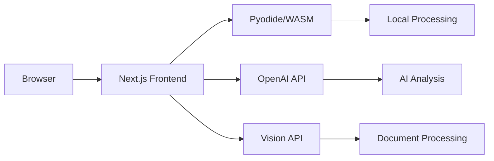

<div align="center">
  

  # Probly
  ### Data analysis with spreadsheets made simple

  [](https://discord.gg/S273ycM6zW)
  [](LICENSE)
</div>

## What is Probly?

Probly is a next-generation spreadsheet application that combines the power of traditional spreadsheets with AI-driven analysis, Python computation, and intelligent document processing.

## Key Features

- **Smart Spreadsheet**: Full-featured spreadsheet with formula support and intelligent cell suggestions
- **Python Integration**: Run Python code directly in your browser using WebAssembly
- **Data Visualization**: Create interactive charts and visualizations
- **AI-Powered Analysis**: Get intelligent insights and automated trend analysis
- **Document Processing**: Extract and process data from images.
- **Prompt Library**: Access predefined analysis templates and save custom prompts


## 🏗️ Architecture

Probly leverages a modern, privacy-focused architecture:



- **Frontend**: Next.js 14 with TypeScript and React
- **Python Runtime**: Pyodide (WebAssembly) for local execution
- **AI Integration**: OpenAI API for intelligent analysis
- **Document Processing**: Vision API for extracting data from documents

## Features

- **Interactive Spreadsheet**: Full-featured spreadsheet with formula support
- **Python Analysis**: Run Python code directly in your browser using WebAssembly
- **Data Visualization**: Create charts and visualizations from your data
- **AI-Powered**: Get intelligent suggestions and automated analysis
- **Prompt Library**: Access predefined prompts or save your own for quick reuse

## Architecture

Probly uses a modern architecture:

- **Frontend**: Next.js application that runs in the browser
- **Python Execution**: Pyodide (Python compiled to WebAssembly) runs entirely in the browser
- **LLM Integration**: OpenAI API calls are proxied through the server

This design means that data analysis happens locally in your browser, providing better performance and privacy.

## Requirements

- Node.js 18 or higher
- npm or yarn
- A modern web browser (Chrome, Firefox, Edge, or Safari)
- OpenAI API key

## 🚀 Quick Start with Docker

The fastest way to get started with Probly:

1. 📥 Clone the repository:
   ```bash
   git clone https://github.com/PragmaticMachineLearning/probly.git
   cd probly
   ```

2. 🔑 Create a `.env` file with your OpenAI API key:
   ```bash
   OPENAI_API_KEY=your_api_key_here
   ```

3. 🐳 Build and start with Docker:
   ```bash
   docker compose build
   docker compose up -d
   ```

4. 🌐 Access Probly at http://localhost:3000

## 💻 Manual Installation

Prefer running without Docker? Here's how:

1. 📥 Clone the repository:
   ```bash
   git clone https://github.com/PragmaticMachineLearning/probly.git
   cd probly
   ```

2. 📦 Install dependencies:
   ```bash
   npm install
   ```

3. 🔑 Set up your environment:
   ```bash
   OPENAI_API_KEY=your_api_key_here
   ```

4. 🚀 Start development server:
   ```bash
   npm run dev
   ```

## 🎯 Using Probly

1. 🌐 Launch the application in your browser
2. 📤 Import your data or start with a blank sheet
3. 🤖 Access AI features with keyboard shortcuts:
   - **Windows/Linux**: `Ctrl+Shift+?`
   - **Mac**: `⌘+Shift+?`
4. 📚 Use the prompt library for quick analysis
5. 📄 Upload documents for automatic data extraction
6. 💬 Ask questions about your data in natural language

## ⌨️ Keyboard Shortcuts

| Action | Windows/Linux | Mac |
|--------|--------------|-----|
| AI Chat | `Ctrl+Shift+?` | `⌘+Shift+?` |
| Prompt Library | `Ctrl+Shift+L` | `⌘+Shift+L` |

## 🛠️ Tech Stack

- **Frontend**: Next.js 14, TypeScript, React
- **Spreadsheet**: Handsontable, HyperFormula
- **Python**: Pyodide (WebAssembly)
- **AI**: OpenAI API (GPT-4, Vision API)
- **Visualization**: ECharts

## 📚 Documentation

For detailed documentation, visit our [Probly Documentation](https://probly-ai.readthedocs.io/en/latest/).

## 👥 Community

Join our [Discord community](https://discord.gg/S273ycM6zW) to:
- 💡 Share ideas and get help
- 🎉 Stay updated on new features
- 👥 Connect with other users
- 🤝 Contribute to development

## 📄 License

[MIT License](LICENSE) - Feel free to use and modify!
